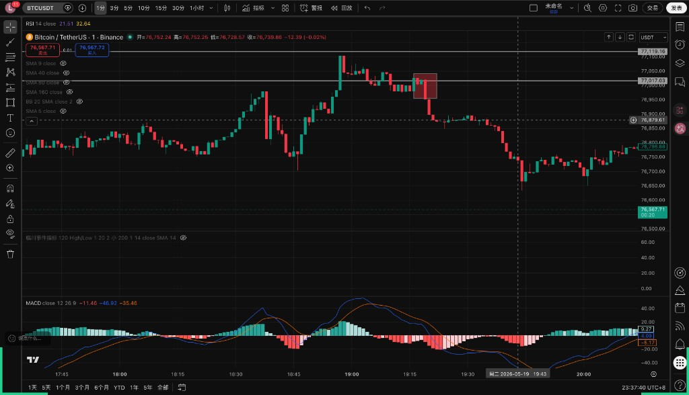
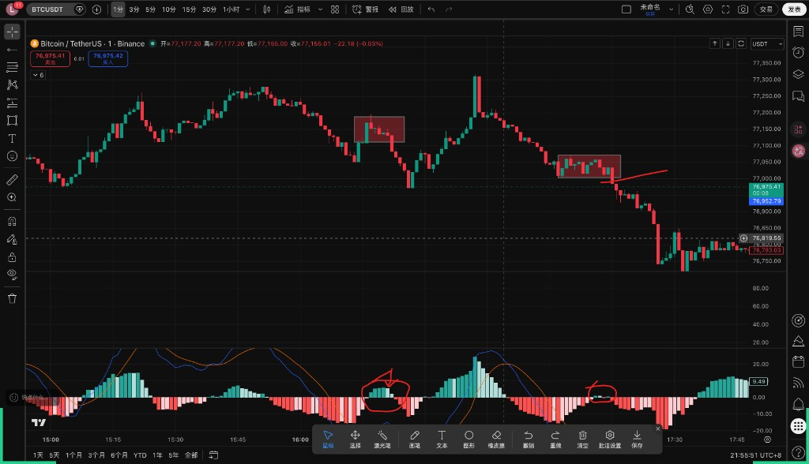
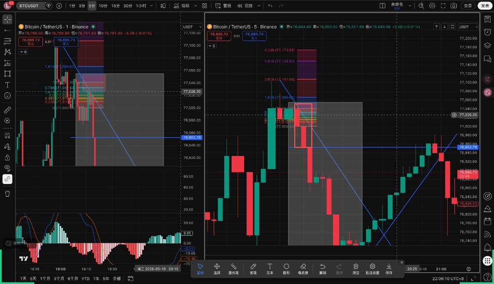
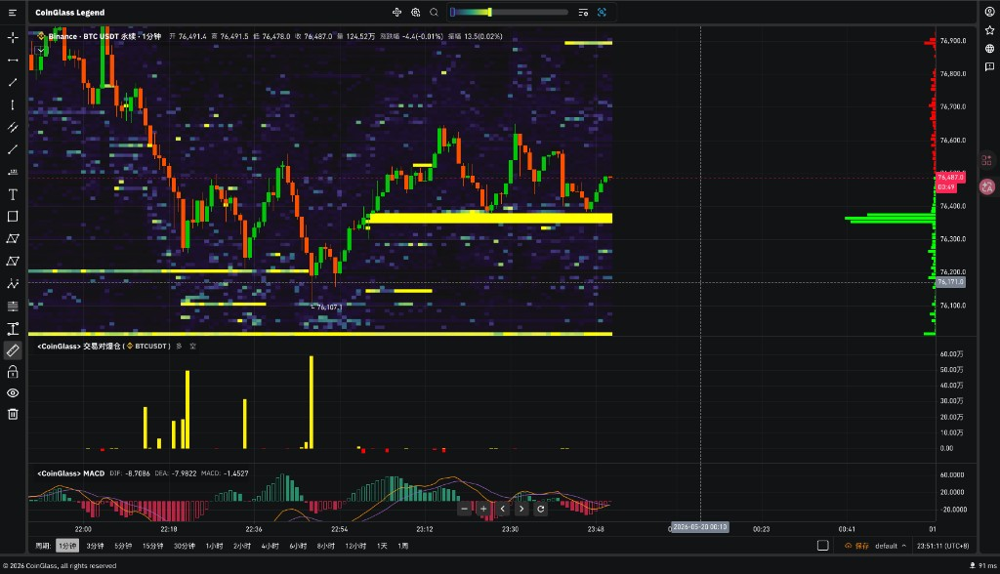
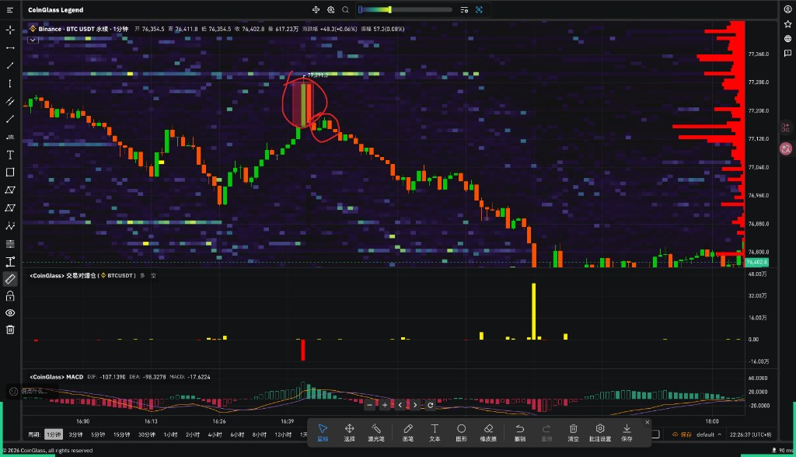

# 临川事件合约教学第一期-新手基础

## 1. 如何分析比特币的价格走势

### 1.1 如何看趋势

- 学会画趋势线。

### 1.2 看盘口

常用工具：

- 币安现货盘口
- Coinglass 盘口
- Coinank 盘口
- Bookmap
- ATAS

### 1.3 确认 K

- 收针。
- 红绿红 / 绿红绿：后面的 K 要长于中间的 K。

- 前提是有超过四根横盘，破新底 / 新高时出现有能量的 K，用来判断反转力量强不强。

## 2. 反转形态

1. 有一根当前操作级别的反转 K 已经出现。
2. 在 0.618 的位置达成反转共识。

这个方法可以提前预判 MACD，通常会比 MACD 信号早 2-5 分钟。

## 3. 流动性：反转 / 顺势趋势参考点

### 3.1 参考工具

1. 爆仓指标：Coinglass。
2. 流动性热图：通常会呈现黄色的横盘区。

### 3.2 进场方式

- 左侧：遇到流动性时，参考大级别有没有反转的可能，可以直接左侧进场。

- 右侧：出现同样的等长 K 两次，在第二次的时候进。

## 4. MACD 如何运用在事件合约-此方法纯赌

1. MACD 在 0 轴下方 / 上方的时候，可以尝试左侧。
2. 在等同高点破掉之后买。
3. MACD 二次加强的时候买，震荡行情的胜算较高。
4. MACD 三次加强的时候补仓，不能吃的时候，通常代表极强单边。

## 5. 加入交流群

如果你想继续学习 5 分钟事件合约，可以加入我们的交流社群。

- 群聊联系方式：1009269364
- 进群密码：50

群内会持续分享 5 分钟事件合约的基础教学、实战思路、盘口观察、流动性判断和风险控制方法，帮助新手更快理解事件合约的交易逻辑。

目前 5 分钟事件合约返佣支持全平台最高 11.9%，适合经常参与短线事件合约的用户。返佣可以降低交易成本，但交易本身仍然有风险，进场前一定要控制仓位、设置止损，不要高杠杆硬扛。